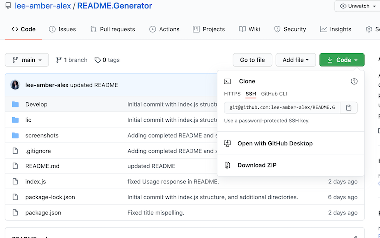
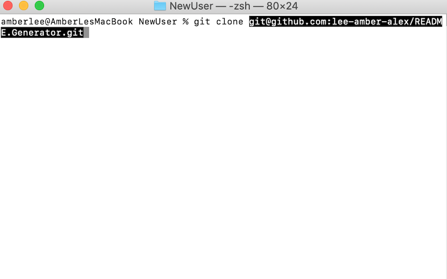
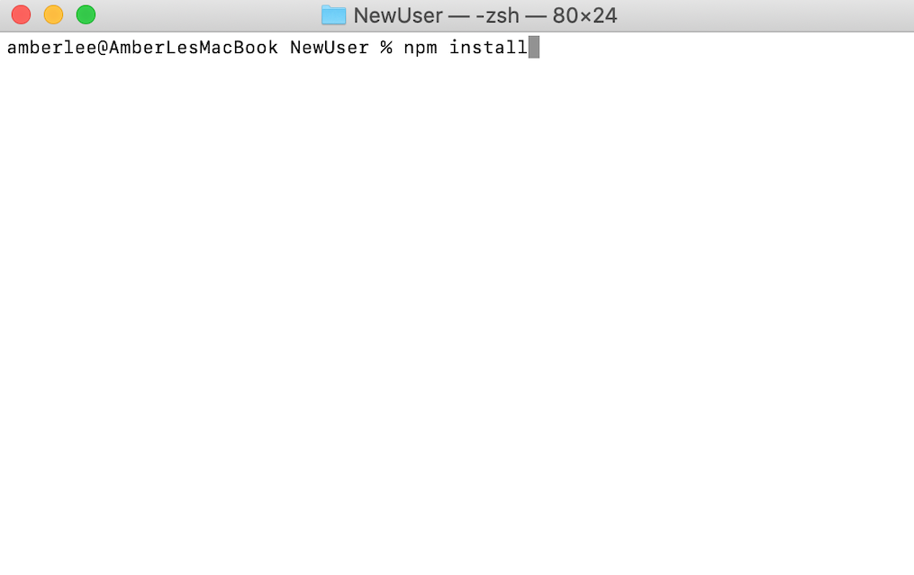
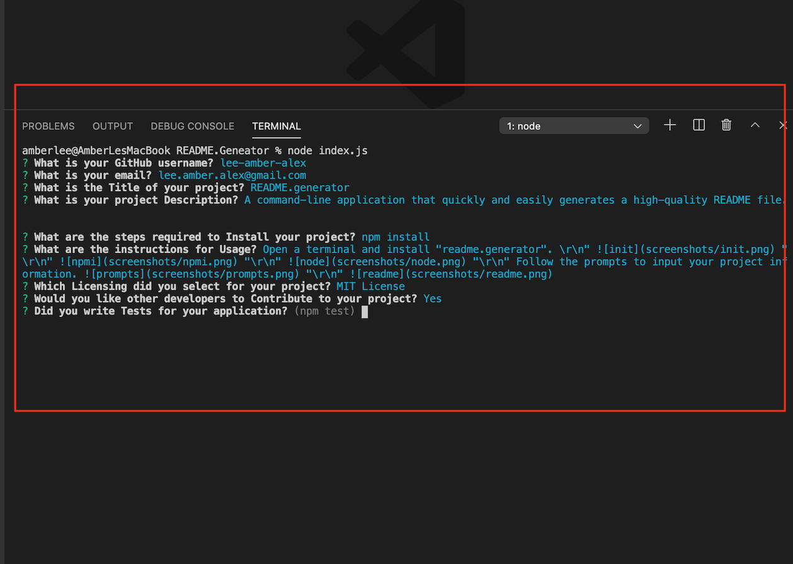
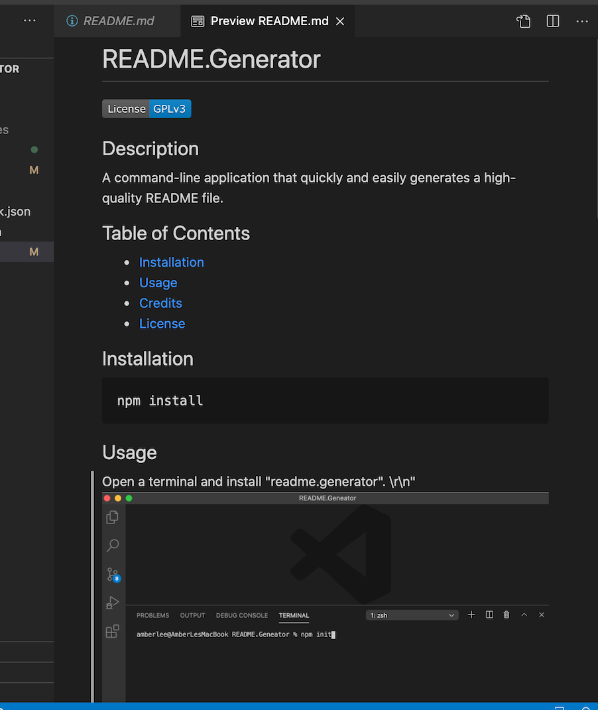

# README.generator

[](https://www.gnu.org/licenses/gpl-3.0)
      
     
## Description

A command-line application that quickly and easily generates a high-quality README file.  This application reduces time spent on formatting README information and provides a consistent format.  Technologies used: Node.js and Inquirer.

## Table of Contents
 
* [Installation](#installation)
* [Usage](#usage)
* [License](#license)
 
## Installation
```
npm i
``` 

## Usage
Watch the README.Generator demo [here.](https://vimeo.com/475283514/7fb19a9a52)  

Access the project repository [here.](https://github.com/lee-amber-alex/README.Generator)   

Navigate to the project directory and clone README.Generator repo.       Next "npm install".   Follow the prompts to input your project information.    

## License
This project is covered under the GNU GPL.
 
## Contributing
[](code_of_conduct.md) 


## Questions
- [Email](lee.amber.alex@gmail.com)
- [Github Page](https://github.com/lee-amber-alex)
 
