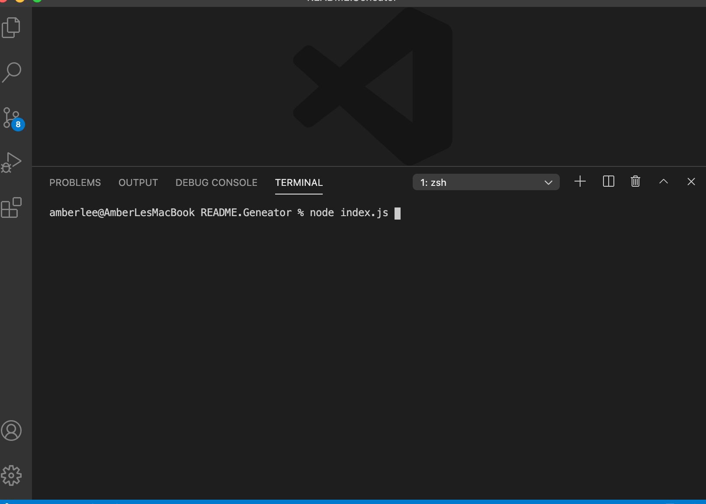

# README.generator

[](https://www.gnu.org/licenses/gpl-3.0)
      
     
## Description

A command-line application that quickly and easily generates a high-quality README file.

## Table of Contents
 
* [Installation](#installation)
* [Usage](#usage)
* [Credits](#credits)
* [License](#license)
 
## Installation
```
npm install
``` 

## Usage
Open a terminal and install "readme.generator".    Follow the prompts to input your project information.    

## License
This project is covered under the GNU GPL.
 
## Contributing
[](code_of_conduct.md) 


## Tests
```
npm test
``` 

## Questions
- [Email](lee.amber.alex@gmail.com)
- [Github Page](https://github.com/lee-amber-alex)
 
